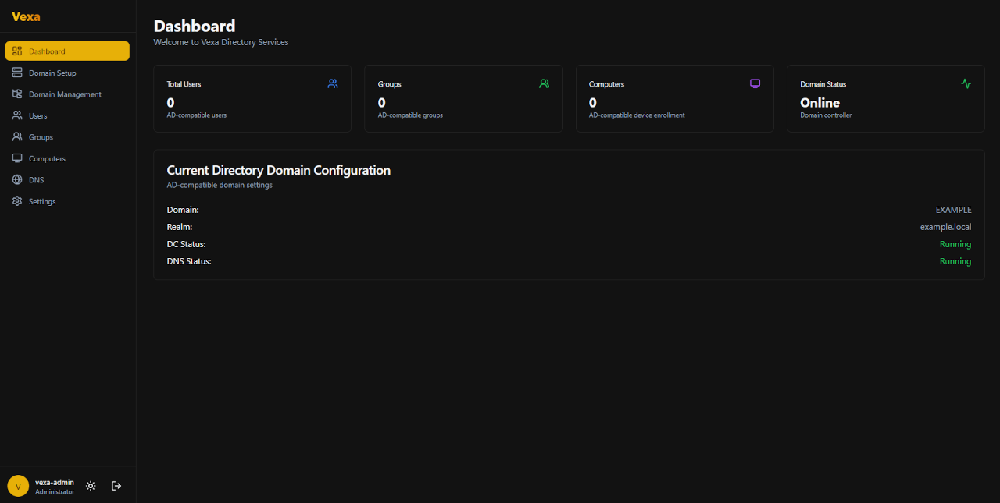

# Vexa - Directory Services Platform

A modern, open-source directory services platform built on Samba AD DC with a beautiful web-based management interface.


*Vexa's modern, responsive web interface with dark mode support*

## Features

- **Samba-based AD DC**: Full AD-compatible Domain Controller functionality
- **Modern Web Interface**: Beautiful, responsive React-based admin interface
- **PAM Authentication**: Authenticate with Linux PAM or directory credentials
- **User & Group Management**: Easy-to-use interface for managing AD-compatible users and groups
- **DNS Management**: Integrated DNS management (BIND9 or Samba Internal)
- **Mobile Responsive**: Works on desktop, tablet, and mobile devices
- **Light & Dark Mode**: Comfortable interface for any environment
- **LXC Compatible**: Can run in full Linux or LXC containers

## Architecture

- **Backend API**: Go-based REST API with PAM authentication
- **Frontend**: React + Vite + Tailwind CSS + TypeScript
- **Domain Controller**: Samba AD DC
- **DNS**: Samba Internal DNS or BIND9
- **Authentication**: Kerberos + LDAP

## Prerequisites

- Linux system (Ubuntu, Debian, RHEL, CentOS, Rocky Linux, or Arch)
- Root or sudo access
- Go (already installed)
- Dart (already installed)
- Node.js will be installed by bootstrap script

## Quick Start

### 1. Install Dependencies

Run the bootstrap script to install all required dependencies:

```bash
sudo ./bootstrap.sh
```

This will install:
- Samba AD DC
- Kerberos
- BIND9 (or configure Samba Internal DNS)
- Node.js (for frontend)
- All required system packages

### 2. Start the API Backend

```bash
cd api
cp .env.example .env
# Edit .env and set a secure JWT_SECRET
go mod download
go run .
```

The API will start on `http://localhost:8080`

### 3. Start the Frontend

In a new terminal:

```bash
cd web
npm install
npm run dev
```

The web interface will start on `http://localhost:5173`

### 4. Login

Open your browser to `http://localhost:5173` and login with your Linux user credentials (must be a sudoer or in the wheel group).

### 5. Provision Your Domain

Navigate to "Domain Setup" in the sidebar and configure your new Active Directory domain.

## Project Structure

```
Vexa/
├── bootstrap.sh          # Dependency installation script
├── api/                  # Go backend API
│   ├── main.go
│   ├── handlers/         # API route handlers
│   ├── middleware/       # Auth & CORS middleware
│   └── utils/            # Utility functions
├── web/                  # React frontend
│   ├── src/
│   │   ├── components/   # Reusable UI components
│   │   ├── pages/        # Page components
│   │   ├── layouts/      # Layout components
│   │   ├── stores/       # Zustand state management
│   │   └── lib/          # API client & utilities
│   └── package.json
└── README.md
```

## API Endpoints

### Authentication
- `POST /api/v1/auth/login` - Login with PAM credentials

### Domain Management
- `POST /api/v1/domain/provision` - Provision new domain
- `GET /api/v1/domain/status` - Get domain status
- `PUT /api/v1/domain/configure` - Update domain configuration

### User Management
- `GET /api/v1/users` - List all users
- `POST /api/v1/users` - Create new user
- `GET /api/v1/users/:id` - Get user details
- `PUT /api/v1/users/:id` - Update user
- `DELETE /api/v1/users/:id` - Delete user

### Group Management
- `GET /api/v1/groups` - List all groups
- `POST /api/v1/groups` - Create new group
- `GET /api/v1/groups/:id` - Get group details
- `PUT /api/v1/groups/:id` - Update group
- `DELETE /api/v1/groups/:id` - Delete group

### DNS Management
- `GET /api/v1/dns/zones` - List DNS zones
- `GET /api/v1/dns/records` - List DNS records
- `POST /api/v1/dns/records` - Create DNS record
- `DELETE /api/v1/dns/records/:id` - Delete DNS record

## Firewall Configuration

Make sure these ports are open:

- **DNS**: 53/tcp, 53/udp
- **Kerberos**: 88/tcp, 88/udp
- **LDAP**: 389/tcp, 389/udp
- **SMB**: 445/tcp
- **Kerberos Password**: 464/tcp, 464/udp
- **LDAPS**: 636/tcp
- **Global Catalog**: 3268/tcp, 3269/tcp
- **API**: 8080/tcp (for development)
- **Web**: 5173/tcp (for development)

## Development

### Backend

```bash
cd api
go run .
```

### Frontend

```bash
cd web
npm run dev
```

### Build for Production

**Backend:**
```bash
cd api
go build -o vexa-api
```

**Frontend:**
```bash
cd web
npm run build
# Output will be in web/dist/
```

## Security Notes

- Change the default JWT_SECRET in production
- Use strong passwords for domain administrator account
- Run behind a reverse proxy (nginx/Apache) in production
- Enable HTTPS in production
- Restrict API access with firewall rules
- Keep system packages updated

## Contributing

This is an open-source project. Contributions are welcome!

## License

[Add your license here]

## Support

For issues and questions, please open an issue on GitHub.

